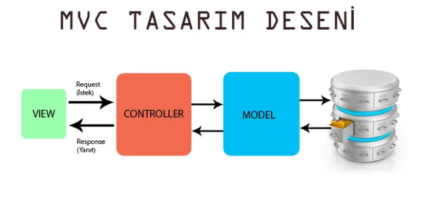

[comment]: <> (başlık)
<h1 align="center"> ENOCA JAVA BACK-END CASE </h1>


### MVC kavramını açıklar mısınız?
Yazılım tasarım kalıbı olan MVC(Model View Controller),yazılım katmanlarını, sorumluluklarına göre birbirinden
bağımsız ve modüler olarak temiz,anlaşılır şekilde geliştirme yapmayı sağlar ve sonrasında bakımı kolaylaştırır. Yani MVC yazılan yazılım bileşenlerinin bir birine bağımlılığının en az olmasını ve bir araya geldiklerinde de uyumlu şekilde çalışabilecek geliştirmeler yapmayı sağlamaktadır.(yüksek uyum düşük bağlılık) Kullanıcı arabirimleri geliştirmek için yaygın olarak da kullanılmaktadır.

[comment]: <> (resim)


<p align="center">

</p>

* **View (Presentation layer)** :elde edilen verilerin görselleştirdikten sonra çıktısının verildiği  ve
  kullanıcılardan alınan
  istekleri controller’a ilettiği katmanıdır.Örneğin müşteri görünümü, son kullanıcının etkileşimde
  bulunduğu metin kutuları, açılır menüler vb. Gibi tüm UI bileşenleri. Özetle verilerin kullanıcıya UI üzerinden
  gösterilmesini yönetir. Html dosyaları bulunur.


* **Model(Business logic)** : veri tabanı(data access) ve doğulama(validate) işlemlerini yönetir.


* **Controller** : Kullanıcılardan gelen istekler (request) Controller’larda değerlendirilir,   isteğin detayına göre   hangi işlemlerin yapılacağı ve kullanıcıya hangi View’ın döneceği (response) belirtilir. Yani kullanıcı   girdilerine (input) göre modelde değişiklik yapar ve değişen modele göre viewi günceller.

### MVC'ye neden ihtiyaç duyuluyor?

* Güvenlidir,esnek yapıya sahiptir, veri bütünlüğü sağlar, geliştirilebilir, yönetim kolaylığı sağlar,ölçeklenebilirdir.

* MVC ile istemci'nin istek göndereceği adresler üzerinde çok büyük kontrol imkanı vardır. Bu sayede adresin içerik
  ile tam bir ilişki içerisinde olması sağlanmıştır. Arama motorları için adres-içerik ilişkisi önemli olduğu için uygulamanın bulunabilirliğine katkısı yüksektir.

* Data katmanındaki herhangi bir değişiklik diğer katmanları etkilememesi için katmanlar arasında genelde
  interface'ler kullanarak erişim sağlanır.Örneğin MySQL'den Oracle'a geçilecek sadece data katmanını yeniden
  düzenlemek yeterli olacaktır. Veri tabanı türünün değişimi kolaydır.

* Büyük çaplı projelerde projelerin yönetiminin ve kontrolünün daha rahat sağlanabilmesi için tercih edilmektedir.

* MVC ile geliştirilen projelerde projenin detaylarına göre bir çok kişi eş zamanlı olarak kolaylıkla çalışabilmektedir.

* Herhangi bir kontrolördeki ilgili eylemlerin mantıksal kümelenmesi MVC aracılığıyla sağlanabilir.


***Tüm bunların yanı sıra asıl sebebi iç içe geçmiş spagetti kod olmamasıdır. Yani spagetti kod olsaydı ve
uygulamanın görünümünü yenilemek isteseydik uygulamanın işleyişinide değiştirmek durumunda kalacaktık ama mvc sayesinde
**yalnızca** görünümle ilgilenerek bunu halledebiliriz. Ayrıca ihtiyaç duyduğumuzda uygulamadaki parçaları başka
uygulamalarda yeniden kullanabiliriz. MVC'nin yüksek uyum düşük bağımlılığı sayesinde bunlar kolaylık sağlıyor ve
bir çok kişi eş zamanlı da çalışabiliyor.***


### Java’da nasıl kurgulanıyor?

Java'da Spring ile birlikte kullanılabilir. Maven ile birlikte gerekli paketlerin kurulumu yapıldıktan sonra 
Model, Controller ve View dosyaları hazırlanır. 

Servlet container tarafından uygulamaya ait ayarlar XML(web.xml) veya Java Tabanlı(ServletContainerInitializer) olarak alınır ve işlem başlatılır. Servlet başlangıcında ServletContextListener arayüzünü uygulayan bir sınıf(ContextLoaderListener) belirtilirse(listener-class, addListener) Servlet başlatıldığında(contextInitialized) Servlet context alanına Spring MVC RootContext yüklemesi yapar. RootContext varsayılan olarak ContextLoader.properties dosyasında belirtilen context sınıfını(XmlWebApplicationContext) kullanır. RootContext oluşturulduktan sonra ayar dosyasında belirtilen servlet(servlet-class, addServlet) sınıfının(DispatcherServlet) bir örneği oluşturularak Servlet yaşam döngüsü çalıştırılır. DispatcherServlet Spring MVC tarafından Front-Controller olarak kullanılan sıradan bir Servlet sınıfıdır. (DispatcherServlet->FrameworkServlet->HttpServletBean->HttpServlet)

[comment]: <> (Object Oriented)
### Object oriented katmanları nelerdir?

**Presentation layer(Sunum Katmanı) :** Sunum katmanı, uygulamanın kullanıcısı ile etkileşim için gerekli bileşenleri içerir. Bu tür bileşenlere örnek olarak web sayfaları, zengin müşteri formları, kullanıcı etkileşimi süreci bileşenleri vb. verilebilir.

**Business layer(İş Katmanı) :** İş katmanı, uygulamanın temel iş işlevselliğini kapsar. Durum bilgisi olmayan 
bileşenler kullanılarak basit iş işlevleri uygulanabilirken, karmaşık, uzun süreli işlemler durum bilgisi olan iş akışları kullanılarak uygulanabilir. İş bileşenleri, genellikle iş mantığının karmaşıklığını gizlemek için bir cephe görevi gören bir hizmet arabirimi tarafından ön uç olarak sunulur.

**Data access layer(Veri erişim katmanı) :** veri tabanı(data access) işlemlerini yönetir. Bu katmandaki bileşenler, temel alınan veri erişim teknolojisinin anlamını soyutlayarak iş katmanının iş mantığına odaklanmasını sağlar. Her bileşen tipik olarak, belirli bir işletme varlığı için Oluşturma, Okuma, Güncelleme ve Silme (CRUD) işlemlerini gerçekleştirmek için yöntemler sağlar.


### 2- Birbirinden bağımsız iki platformun birbiriyle haberleşmesi nasıl sağlanabilir. Örneğin, X platformu Java ile yazılmış olsun, Y platform u C# ile. Bu iki platformun bir biri ile iletişim halinde request-response ilişkisi kurması gerekiyor. Bu yapıyı nasıl sağlarız.

Web servis ile yapılabilir. Web servis farklı platformlar arasında XML, JSON, CSV vb. ortak bir biçim kullanarak 
veri alışverişini sağlar. SOAP ve REST olmak üzere iki yöntem vardır.
#### SOAP
* SOAP programlama dilinden bağımsız olarak web servis oluşturmak için kullanılan bir standarttır.
* SOAP tabanlı web servislerin kullanımı REST tabanlı web servislerine göre kullanım zorluğu, sadece XML desteklemesi ve fazla veri kullanımından dolayı azalmıştır.

#### REST
* REST, HTTP protokolüne ait HTTP yöntemlerini ve HTTP durum kodlarını kullanarak gelen isteklere XML, JSON, CSV vb. 
  olarak cevap verir.
* RESTful veya RESTful API, REST mimarisiyle hazırlanmış web servislere denir.

HTTP protokolü; ağ üzerinden, web sayfalarını görüntülemenizi sağlayan; Yani, İstemci (Tarayıcı PC veya Telefon) ile Sunucu (Server) arasındaki kuralları ve iletişimi sağlayan bir internet protokolüdür.
İstemci, sunucuya bir HTTP isteği gönderir bu isteğe “Request” denir,
Sunucu istek karşılığında istemciye bir cevap verir bu tepkiye “Response” denir. HTTP Uygulama (Applicaiton) 
katmanında çalışır ve iletişim için Ulaşım (Transport) katmanından TCP veri aktarım protokolünü kullanır. TCP 
protokolü veri kaybı olmadan veri gönderimi sağlar. Eğer bir paket bozuk veya eksik ise yeniden gönderir. UDP 
Güvenli veri transferi yapmaz yani paket eksik gitmiş, bozuk gitmiş, yarı yolda kalmış UDP’nin umrunda bile değildir.Bu sebeple UDP kullanılmaz ve TCP, HTTP için en ideal veri aktarım protokolüdür.

### 3- Bir web sayfasında ekran sürekli Backend’ den veya bir başka yapı tarafından güncelleniyor. Siz, web sayfasını refresh etmeden bu güncel bilgiyi anlık ekrana nasıl yansıtırsınız.

Arayüzde backend kısmında yapılan herhangi bir değişikliği veya farklı bir sistemden çekilen verileri anlık olarak ekranda gösterebilmek için javascript kütüphanelerinden yararlanılır. API veya realtime veri gönderimi sağlayan (socket.io) gibi yapılarla arayüz oluşturulabilir.

API sistemi için axios, fetch veya ajax kullanılabilir.

```
    function getUIDatas(){
        fetch("/flights",{method:"GET")
        .then((response)=>response.json)
        .then((data)=>{...});
    }
```

Socket.IO, MQTT gibi kütüphanelerde de event oluşturularak veriler kullanılır.

socket.on('data', (response)={...})

### 4 - Bir for döngüsü ile aşağıdaki çıktıyı yazar mısınız.

```
*
**
****
******
********
**********
```

```
static void triangle(int rows){
    for(int i = 0; i < rows; i++){
        for(int j = i; j >= 0; j-- ){
            System.out.print('*');
        }
        System.out.print('\n');
    }
}
public static void main(String []args){
    triangle(5);
}
```
### 5- Firmada çalışman için sana remote bir linux server verildi. Elinde ip adresi port bilgisi kullanıcı adi ve şifren var. Server a erişimi nasıl test edersin, Server a nasıl erişirsin, Server a nasıl dosya atarsın, Serverdan nasıl dosya çekersin.

linux terminale,

```
 ssh username@ipaddress:port
```
yazdıktan sonra şifresi girilir ve SSH bağlantısı sağlanır. Dosya aktarımı için ise,
```
 $ sftp username@ipaddress:port
   $ password
   $ cd your/pathç
   $ put local/file/path/name
   $ quit
```
veya
```
$ scp local/file/path/name username@ipaddress:port:your/path
   $ password
```

kullanılabilir.


### 6. Spring projesi
--> [spring projesi](enocacase)

### 7. Apache Solr servisine yazılacak bir query örneği Apache Solr kullanılan sql programlarından daha farklı runtime bir database. Solr a hali hazırda kayıtlı bir alan olduğunu düşünelim. Alanın ismi “updatedAt” long tipinde tutulan bir alan. Ben 2020 Ocak ayından sonraki verileri getir dediğimde solr a nasıl bir query yazılmalı. http://example?query= kısmını nasıl doldurmalıyım?

Öncelikle verilen tarihin long tipine dönüştürülmesini sağlarım.
```
const longDate = new Date('2020-01-01T00:00:00z')*1;
```
Sonuc : 1577836800000

İstek atılacak url:
```
http://example/query?fq=updateAt:{1577836800000%20TO%20*}&indent=true&q.op=OR&q=*:*
```
